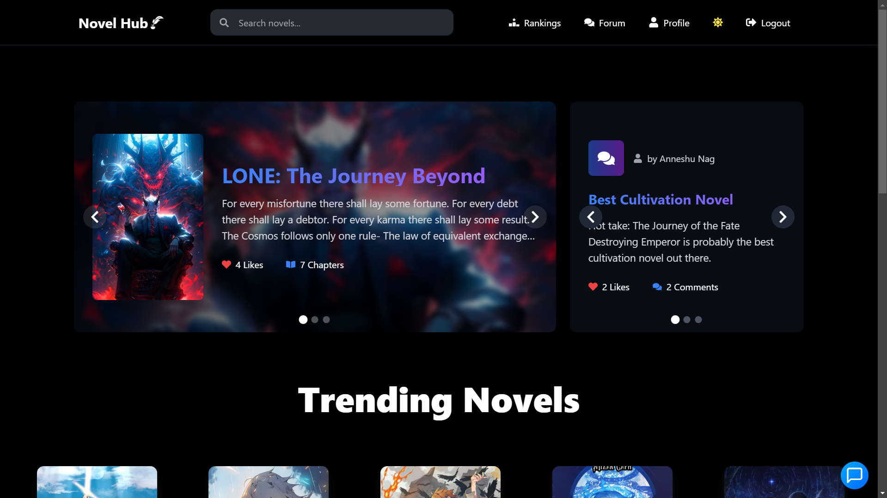

<div align="center">
  <br />
      
  <br />
  <br/>

# Novel Hub

**Novel Hub** is a modern and user-friendly web application designed for avid novel readers and aspiring authors. This platform to foster a community of web novel enthusiasts, providing a platform for readers to engage in discussions, reviews, and ratings while allowing authors to publish and manage their works.

</div>

## Table of Contents
- [Features](#features)
- [Prerequisites](#prerequisites)
- [Installation](#installation)
- [Usage](#usage)
- [Routes Overview](#routes-overview)
- [AI Chatbot (Novik)](#ai-chatbot-novik)
- [Contribution](#contribution)

---

## Features

### For Users:
- 📚 **Browse Novels**: Explore a wide range of novels.
- 📖 **Read Chapters**: Dive into your favorite stories chapter by chapter.
- ⭐ **Write and Read Reviews**: Share and explore opinions on novels.
- 🎯 **Get Recommendations**: Receive personalized novel suggestions.
- 🗣️ **Forum**: Post thoughts and interact with the community.

### For Authors:
- ✍️ **Become an Author**: Apply for authorship directly via the profile page.
- 📊 **Novel Analytics**: View stats and engagement data for your novels.
- 📝 **Upload Novels and Chapters**: Publish your work and keep it updated.

### Authentication:
- Secure login using Google or email/password.
- Protect user privacy with no data sharing.
- Users can request data deletion via support.

### AI Assistant:
- Intelligent chatbot "Novik" to assist users with queries and navigation.
- Clear, concise, and friendly responses.

---

## Prerequisites
- **Node.js** (v16.0 or higher)
- **npm** (v8.0 or higher)
- MongoDB instance
- Google OAuth credentials (if using Google login)
- **Cloudinary** credentials (for image and video storage) 
- **Gemini API Key** for AI chatbot
---

## Installation

1. **Clone the Repository:**
   ```bash
   git clone https://github.com/NK-Works/Novel-Hub.git
   cd novel-hub
   ```

2. **Open both the Directories:**
   ```bash
   cd frontend (for frontend)
   cd backend (for backend)
   ```

2. **Install Dependencies:**
   ```bash
   npm install
   ```

3. **Set Environment Variables:**
   Create a `.env` file in the **backend** root directory and add:
   ```env
   PORT=3002
   MONGO_URI=your_mongodb_connection_string
   jwt_secret=your_jwt_secret
   GOOGLE_CLIENT_ID=your_google_client_id
   GOOGLE_CLIENT_SECRET=your_google_client_secret
   CLOUDINARY_CLOUD_NAME=cloudinary_cloud_name
   CLOUDINARY_API_KEY=cloudinary_api_key
   CLOUDINARY_API_SECRET=cloudinary_api_secret
   GEMINI_API_KEY=gemini_api_key
   ```
   Create a `.env` file in the **frontend** root directory and add:
   ```env
   VITE_API_URL=http://localhost:3002/api
   VITE_API_GOOGLE_CLIENT_ID=your_google_client_id
   ```

4. **Start the Application:**
   Start the **backend** using:
   ```bash
   npm start
   ```
   Start the **frontend** using:
   ```bash
   npm run dev
   ```
---

## Usage

### Accessing the Application
- Visit `http://localhost:5173` to access the frontned and `http://localhost:3002` to access the backend locally.
- Register or log in using Google or email/password.

### Navigating the Application
- **Home Page:** Browse trending and new novels.
- **Rankings Page:** Discover top-rated novels.
- **Search:** Find novels by name or genre.
- **Profile:** Manage your account, apply for authorship, and view stats.
- **Forum:** Share thoughts and connect with the community.

---

## Routes Overview

### Publicly Accessible Routes:
- `/home` - Home page
- `/login` - Login page
- `/signup` - Sign-up page
- `/rankings` - Rankings page
- `/search` - Search for novels

### Authenticated User Routes:
- `/novels/:id` - View novel details
- `/novels/:id/chapters` - View chapters of a novel
- `/novels/:novelId/reviews/:reviewId` - View specific review
- `/profile` - Access user profile
- `/forum` - Engage with the community
- `/novel-analytics/:novelId` - View analytics of authored novels

### Error Handling:
- `/*` - Displays a custom 404 page

---

## AI Chatbot (Novik)

Novik is an intelligent chatbot integrated into the application to assist users with:
- Navigating the platform
- Understanding features
- Answering common queries

**Behavior:**
- Provides clear, concise responses.
- Handles out-of-scope queries politely.
- Does not share user data or provide irrelevant suggestions.

**Example Queries:**
- "Show me novels"
- "Help with chapters"
- "How to write review"
- "Recommend novels"

---

## Contribution

We welcome contributions to enhance Novel Hub! To contribute:
1. Fork the repository.
2. Create a new branch for your feature/bugfix.
3. Submit a pull request with detailed explanations.

---

Enjoy using **Novel Hub** and happy reading!
# novelwebs
# novelweb
